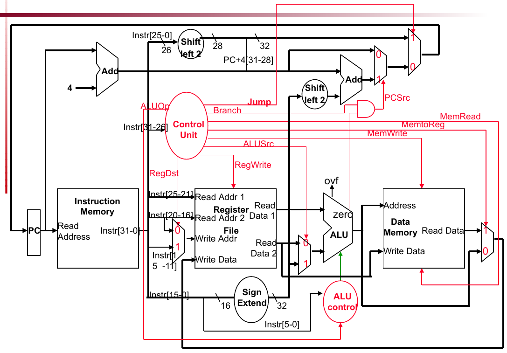

# Single-Cycle ARMv8 CPU in Verilog

## CPU Datapath



This project implements a single-cycle ARMv8-style processor in Verilog for ECEN 350 at Texas A&M University. 
The CPU supports instruction fetch, register file access, ALU execution, data memory access, writeback, and PC update logic.

## Main Features
- Single-cycle datapath
- Program Counter and Next PC logic
- Instruction Memory and Data Memory
- 32x64-bit register file
- ALU operations: AND, ORR, ADD, SUB, PASSB
- Load/store support: LDUR, STUR
- Branch support: B and CBZ
- Immediate sign extension
- MOVZ support for building 64-bit constants

## Files
- `SingleCycleProc.v` – top-level CPU datapath
- `SingleCycleControl.v` – control unit
- `ALU.v` – arithmetic and logic unit
- `RegisterFile.v` – 32-register file
- `SignExtender.v` – immediate extension logic
- `NextPClogic.v` – PC update and branch logic
- `InstructionMemory.v` – instruction memory
- `DataMemory.v` – data memory
- `SingleCycleProcTest.v` – processor testbench

## MOVZ Extension
For the MOVZ instruction, I added a `MovZ` control signal.  
The control unit asserts `MovZ = 1` only for MOVZ, then the sign extender zero-extends the 16-bit immediate and shifts it by `hw * 16`. This allows the processor to build a full 64-bit constant using multiple MOVZ and ORR instructions. :contentReference[oaicite:0]{index=0}

## How to Run

Compile the processor:

```bash
iverilog -g2012 -o sc_top_tb SingleCycleProcTest.v SingleCycleProc.v \
SingleCycleControl.v RegisterFile.v SignExtender.v ALU.v NextPClogic.v \
InstructionMemory.v DataMemory.v
